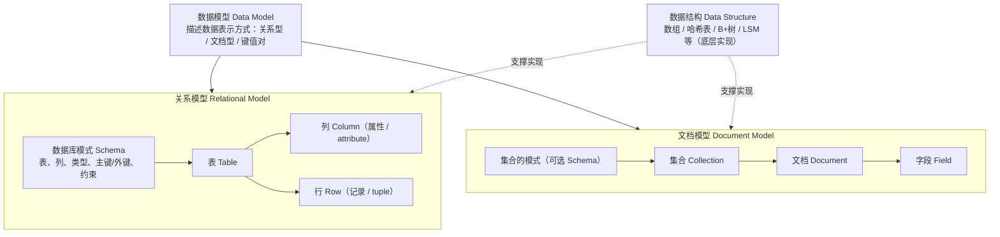
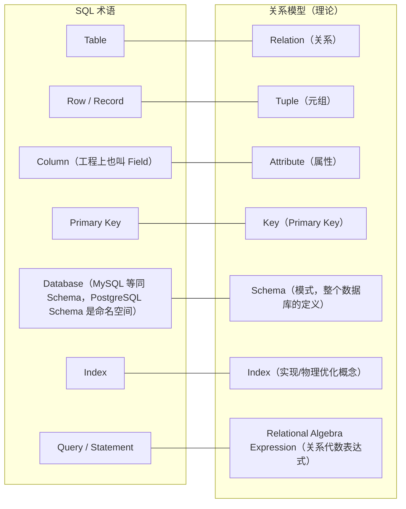

# Node.js/Express 函数与方法小册（基于你的示例项目）

> 这份文档按“**输入 → 输出 → 用途/要点 → 示例**”来讲每个函数/方法。简单的 `app.get/post/put/delete` 我合并讲，像 `findIndex` 这类前端常考的 JS 基础会细讲。示例均可直接复习/Copy 用。

---

## 项目结构中的关键点（背景）
- 使用 `Express` 暴露 REST API；用 `JSON` 文件当作简易数据库（`db.json`）。
- 认证使用 **JWT**（`jsonwebtoken`）与 **bcrypt**（`bcryptjs`）。
- 身份校验通过自定义中间件 `authenticateToken` 实现，路由如 `/api/investments` 受保护。

---

## 1) 环境变量与启动

### `require('dotenv').config()`
- **输入**：无；从项目根目录读取 `.env`。
- **输出**：把 `.env` 中的键值注入 `process.env`。
- **用途**：安全地管理 `JWT_SECRET`、`PORT` 等敏感配置。
- **示例**
  ```js
  require('dotenv').config()
  const JWT_SECRET = process.env.JWT_SECRET
  const PORT = process.env.PORT || 3000
  ```

### `app.listen(PORT, cb)`
- **输入**：端口号与回调。
- **输出**：启动 HTTP 服务器。
- **用途**：启动服务并监听端口。
- **补充**：Node.js让操作系统监听PORT端口，当PORT端口收到请求时，操作系统把这个请求交给Node.js处理。
- **时序图**：
  ```mermaid
      sequenceDiagram
          autonumber
          participant App as 你的代码(app.listen)
          participant Node as Node.js
          participant OS as 操作系统
          participant EvLoop as 事件循环
          participant Express as Express
          participant Handler as 路由处理函数
          participant Client as 客户端

          App->>Node: 创建HTTP服务器并调用 listen(PORT)
          Node->>OS: 请求监听 PORT
          OS-->>Node: 端口就绪
          Node-->>App: 执行回调(console.log)

          Client->>OS: 连接 :PORT 并发送HTTP请求
          OS-->>Node: 把请求交给 Node.js
          Node->>EvLoop: 投递“请求到达”事件
          EvLoop->>Express: 路由匹配/中间件
          Express->>Handler: 执行(req, res)
          Handler-->>Client: 返回响应
  ```

- **示例**
  ```js
  app.listen(PORT, () => console.log(`Server on http://localhost:${PORT}`))
  ```

---

## 2) Express 基础

### `express()` / `app`
- **输入**：无。
- **输出**：返回 Express 应用实例。
- **用途**：挂载中间件、路由与错误处理器。

### `app.use(express.json())`
- **输入**：无（中间件）。
- **输出**：为后续路由提供已解析的 `req.body`（JSON）。
- **用途**：解析 JSON 请求体，便于直接从 `req.body` 读取字段。

### 路由方法：`app.get/post/put/delete(path, ...handlers)`
- **输入**：URL 路径与一个或多个处理器（中间件/控制器）。
- **输出**：根据请求返回响应。
- **用途**：定义资源的 CRUD。四者**格式一致**，最大差异在**语义**与**是否幂等**。
- **示例（合并讲）**
  ```js
  app.get('/api/investments', authenticateToken, handler)     // 读
  app.post('/api/investments', authenticateToken, handler)    // 新建
  app.put('/api/investments/:id', authenticateToken, handler) // 全量更新
  app.delete('/api/investments/:id', authenticateToken, handler) // 删除
  ```
  以上均出现在你的代码里。

### `req` / `res` 常用属性
- `req.body`：请求体（需 `express.json()`）。
- `req.params`：路径参数，如 `:id`。例：`req.params.id`。
- `req.headers`：请求头；认证常用 `Authorization` 头。
- `res.status(code).json(data)`：设置 HTTP 状态并返回 JSON。

---

## 3) 认证中间件

### 自定义中间件 `authenticateToken(req, res, next)`
- **输入**：标准 Express 三参：请求、响应、下一步。
- **输出**：通过校验后，将 `req.user` 设置为解码后的 token 载荷；失败则返回 401/403。
- **用途**：保护需要登录的路由。
- **关键点**
  - 从 `Authorization` 头解析 `Bearer <token>`。
  - 用 `jwt.verify` 校验签名与有效期。
  - 成功后 `next()` 放行，失败返回错误。
- **示例**
  ```js
  const authenticateToken = (req, res, next) => {
    const authHeader = req.headers['authorization']
    const token = authHeader && authHeader.split(' ')[1] // Bearer TOKEN
  
    if (!token) return res.status(401).json({ error: 'Access token required' })
  
    jwt.verify(token, JWT_SECRET, (err, user) => {
      if (err) return res.status(403).json({ error: 'Invalid or expired token' })
      req.user = user
      next()
    })
  }
  ```

---

## 4) JWT（`jsonwebtoken`）

### `jwt.sign(payload, secret, options)`
- **输入**：`payload`（对象）、`secret`、可选 `expiresIn` 等。
- **输出**：**字符串** token。
- **用途**：在登录成功后给前端一个可携带身份的 token。
- **示例**
  ```js
  const token = jwt.sign(
    { userId: user.id, username: user.username },
    JWT_SECRET,
    { expiresIn: '24h' }
  )
  ```

### `jwt.verify(token, secret, callback)`
- **输入**：`token`、`secret`、回调 `(err, decoded)`。
- **输出**：回调拿到 `decoded`（即 payload）。
- **用途**：校验 token 真实性与有效期，失败时给 403。

---

## 5) 密码散列（`bcryptjs`）

### `bcrypt.hash(plain, saltRounds)`
- **输入**：明文密码、盐强度（常见 10）。
- **输出**：**字符串** 哈希值。
- **用途**：注册时保存哈希而非明文，避免信息泄露。
- **示例**
  ```js
  const hashedPassword = await bcrypt.hash(password, 10)
  ```

### `bcrypt.compare(plain, hash)`
- **输入**：明文密码、已保存的哈希。
- **输出**：**布尔**（是否匹配）。
- **用途**：登录时验证密码。

### 相关知识补充
- **为什么bcrypt有关的函数要用async/await？**
  - Node.js 是单线程的，如果你用同步的密码哈希方法（bcrypt.hashSync），一次哈希可能要几十到几百毫秒，这段时间整个进程不能处理其他请求。
  - 异步方法（bcrypt.hash / bcrypt.compare）内部会把计算丢给线程池（libuv），在哈希的同时，主线程可以去处理其他请求。libuv是Node.js的异步I/O库，负责管理事件循环和线程池。
- **单线程不应该很慢吗？为什么还能做高并发？**：
  - Node.js 之所以能做高可用、高并发、高性能的后端，是因为单线程事件循环避免了多线程的开销，异步 I/O + 线程池让它几乎不被阻塞。在 I/O 密集型场景里，它能轻松撑住上万连接。
  - 高并发并不等于多线程：
    高并发指的是同时处理很多请求，而不是同时并行跑很多计算。大部分 Web 请求 不是一直在计算，而是在：等数据库响应、等磁盘读写、等网络 API。这些等待时间里，CPU 是空闲的，如果你用多线程来等，其实浪费资源。
  - Node.js 的设计哲学：
      - 主线程负责调度（事件循环）
      - 耗时的 I/O 交给线程池/操作系统（异步 I/O）
      - 当 I/O 完成，结果回调到事件循环继续执行
      所以：
        - 主线程几乎不等，所以可以很快地处理成千上万的连接
        - 内存占用低（不像 Java/C++ 那样为每个线程分配栈空间）
        - 更适合 I/O 密集型任务（API 网关、实时推送、聊天、文件上传等）
- **为什么依然能“高性能”？**
  - 少上下文切换：
    - 多线程模型下，线程多了要频繁切换上下文（保存和恢复寄存器、栈等）
    - Node.js 只有一个主线程执行 JS，调度成本极低
  - 非阻塞 I/O：
    - 数据库查询、网络请求、文件 I/O 全部异步
    - 主线程几乎全在跑业务逻辑，而不是在等
  - 事件驱动：
    - 一个请求到来时，如果需要 I/O，立刻挂起，去处理别的请求
    - 完成时回调，不会阻塞别人

  ```mermaid
  sequenceDiagram
    participant Client as 客户端
    participant Main as Node.js 主线程(事件循环)
    participant Pool as 线程池(I/O/CPU密集)
    participant Crypto as bcrypt哈希计算

    Client->>Main: HTTP POST /api/register (username + password)
    Main->>Main: 执行验证输入
    Main->>Pool: bcrypt.hash(password, saltRounds)
    Note right of Main: 主线程立即继续处理其他请求

    Pool->>Crypto: 执行加盐 + 多轮哈希
    Crypto-->>Pool: 生成哈希值
    Pool-->>Main: 发出“哈希完成”事件

    Main->>Main: 事件循环取出回调
    Main->>Main: 将哈希保存到用户对象
    Main->>Main: 写入 db.json
    Main-->>Client: 返回注册成功响应
  ```

---

## 6) 文件系统（`fs`）与路径（`path`）

### `path.join(...segments)`
- **输入**：路径片段。
- **输出**：平台兼容的路径字符串。
- **用途**：保证不同系统路径分隔符一致。
- **示例**：
  ```js
  const dbPath = path.join(__dirname, 'db.json')
  ```

### `fs.readFileSync(file, 'utf-8')`
- **输入**：文件路径、编码。
- **输出**：**字符串** 文件内容。
- **用途**：读取 JSON 字符串，随后用 `JSON.parse` 解析。

### `fs.writeFileSync(file, data)`
- **输入**：文件路径、要写入的字符串（常配 `JSON.stringify`）。
- **输出**：无（写入副作用）。
- **用途**：把更新后的对象持久化到 `db.json`。建议加 `try/catch` 与备份策略。

---

## 7) JSON 相关

### `JSON.parse(string)`
- **输入**：JSON 字符串。
- **输出**：**对象/数组**。
- **用途**：把 `fs.readFileSync` 返回的字符串转为对象再操作。

### `JSON.stringify(obj, null, 2)`
- **输入**：对象（第二、三参用于美化缩进）。
- **输出**：**字符串**。
- **用途**：写回文件/网络响应。`null, 2` 只是让文件更易读。

### 相关知识补充
- **对象（Object）**
  - 在 JavaScript 里，对象是一组键值对（key-value pairs）的集合，用来描述某个事物的属性和行为。
  - 键（key）：属性名（通常是字符串，也可以是 Symbol）
  - 值（value）：可以是任何类型（数字、字符串、布尔值、数组、对象、函数等）
  - 例子：
    ```js
    const user = {
      name: 'Alice',
      age: 20,
      isAdmin: false
    }
    ```
    这里 user 是对象，它有三个键值对。

- **属性（Property）**
  - 对象里的每一对键值就是一个属性：
    - 属性名：id、username、isAdmin
    - 属性值：1、"alice"、false
  - 属性有两种访问方式：
    - 点操作符（dot notation）
      ```js
      console.log(user.username) // "alice" 
      ```
    - 方括号（bracket notation）
      ```js
      console.log(user['username']) // "alice"
      ```
  - `JSON.parse` 的目的就是把 JSON 字符串变成真正的对象，这样你才能用 . 或 [] 访问它的属性。
  - 对象里的属性（property）和数据库里的属性（attribute）是不同的概念。
    - property 是对象里的键值对，对象里“键值对”的键（key）就是属性名，键对应的值就是属性值。
    - attribute 是数据模型中定义的字段，不指某个具体值，而是这个字段本身。
    - HTML里，元素的属性（attribute）是元素的标签里的属性，比如 `<div id="myDiv">` 里的 id 就是 attribute。

- **数据库相关**
- 数据模型（Data Model）：描述数据表示方式：关系型 / 文档型 / 键值对
- 数据结构（Data Structure）：数组 / 哈希表 / B+树 / LSM 等（底层实现）
- 关系模型（Relational Model）：
  - 数据库模式（Schema）：表、列、类型、主键/外键、约束
  - 表（Table）：行（Record）
  - 列（Column）：属性（Attribute）
  - 行（Row）：记录（Tuple）

- 从数据模型到数据库表的层级图:


- SQL vs 理论 vs NoSQL 术语对照表:



---

## 8) 常见数组方法（面试高频 / 需要细讲）

> 下面这些都在你的代码里用到了，尤其是 `findIndex`。

### `Array.prototype.find(callback)`
- **输入**：`callback(element, index, array)` 返回布尔。
- **输出**：**第一个匹配的元素**；未找到则 `undefined`。
- **用途**：查单个对象，如根据 `username` 找用户。
- **示例**
  ```js
  const user = users.find(u => u.username === username)
  ```

### `Array.prototype.filter(callback)`
- **输入**：回调。
- **输出**：**新数组**（所有匹配项）。
- **用途**：按条件筛选，如按 `userId` 过滤投资记录。
- **示例**
  ```js
  const myInvestments = investments.filter(i => i.userId === req.user.userId)
  ```

### `Array.prototype.findIndex(callback)` ✅ **细讲**
- **输入**：`callback(element, index, array)`。
- **输出**：**匹配元素的索引**；未找到返回 `-1`。
- **用途**：当你需要**定位并修改/删除**某个元素时，比 `find` 更合适，因为你拿到的是索引。
- **陷阱**
  - **返回 `-1` 要特别处理**，否则对数组越界读写；你的代码删除/更新前都做了判断。
  - **比较类型**：若 id 是字符串，需要先 `parseInt` 或在存储时统一为数字。
- **示例（删除元素完整流程）**
  ```js
  const id = parseInt(req.params.id, 10)
  const idx = investments.findIndex(x => x.id === id)
  if (idx === -1) return res.status(404).json({ error: 'Not found' })
  const deleted = investments.splice(idx, 1)[0] // 返回被删元素
  ```

### `Array.prototype.push(item)`
- **输入**：要插入的元素。
- **输出**：新数组长度（副作用：原数组尾部增加一项）。
- **用途**：追加记录，如新建用户或投资。

### `Array.prototype.splice(start, deleteCount, ...items)`
- **输入**：起始索引、删除数量、可选要插入的新项。
- **输出**：**被删除的元素数组**；会**原地修改**原数组。
- **用途**：删除或替换元素。删除时常与 `findIndex` 配合。

---

## 9) 其它常用小函数

### `parseInt(string, 10)`
- **输入**：字符串（如 `req.params.id`）。
- **输出**：数字；若无法解析得到 `NaN`。
- **用途**：将 URL 参数转为数字再比较。你的代码用它来对比 `investment.id`。

### `path.join(__dirname, 'db.json')`
- 已在上文讲过；强调：**不要**手写 `'./db.json'` 去猜相对路径，`__dirname` 更稳。

---

## 10) 典型业务流程（把方法串起来）

### 注册 `/api/register`（公开）
1. 读取 `db.json` → `JSON.parse`。
2. `users.find` 检查重名。
3. `bcrypt.hash` 出哈希 → `users.push`。
4. `JSON.stringify` → `fs.writeFileSync` 落盘。
5. `res.status(201).json(...)` 返回用户基本信息。

### 登录 `/api/login`（公开）
1. 读取并 `find` 用户。
2. `bcrypt.compare` 校验密码。
3. `jwt.sign` 生成 `token`。
4. 返回 `token` 与用户信息。

### 访问受保护资源 `/api/investments`（需要 `Bearer <token>`）
1. `authenticateToken`：从 `Authorization` 提取 token → `jwt.verify` → 写入 `req.user`。
2. 在控制器里用 `req.user.userId` 过滤/落数（`filter`/`push`/`findIndex`/`splice`）。

---

## 11) 错误处理与状态码（速查）
- `400 Bad Request`：缺字段/格式错误。
- `401 Unauthorized`：**缺少** token。
- `403 Forbidden`：token 无效/过期。
- `404 Not Found`：资源不存在（如 `findIndex` 为 `-1`）。
- `500 Internal Server Error`：服务器内部错误（`try/catch` 捕获后返回）。

---

## 12) 一页式 cURL 示例

> 先登录拿到 **token**，后续请求带上 `Authorization: Bearer <token>`。

```bash
# 注册
curl -X POST http://localhost:3000/api/register \
  -H "Content-Type: application/json" \
  -d '{"username":"alice","password":"secret"}'

# 登录（拿 token）
curl -X POST http://localhost:3000/api/login \
  -H "Content-Type: application/json" \
  -d '{"username":"alice","password":"secret"}'

# 带 token 获取我的投资
TOKEN="复制上一步返回的token"
curl http://localhost:3000/api/investments \
  -H "Authorization: Bearer $TOKEN"

# 新增投资
curl -X POST http://localhost:3000/api/investments \
  -H "Content-Type: application/json" \
  -H "Authorization: Bearer $TOKEN" \
  -d '{"symbol":"AAPL","amount":100}'

# 更新投资（全量替换）
curl -X PUT http://localhost:3000/api/investments/1 \
  -H "Content-Type: application/json" \
  -H "Authorization: Bearer $TOKEN" \
  -d '{"id":1,"userId":1,"symbol":"AAPL","amount":200}'

# 删除投资
curl -X DELETE http://localhost:3000/api/investments/1 \
  -H "Authorization: Bearer $TOKEN"
```

---

## 13) 面试/实战常见坑位提示
- **`findIndex` 返回 -1 一定要判空**，否则 `splice(-1,1)` 会删掉最后一项。
- **`parseInt` 请写基数 `10`**，避免 `08` 这类被当八进制解析的坑。
- **JWT 只放**必要信息（`userId` 等），敏感信息不要放 token 里。
- **同步 `fs.*Sync` 在高并发会卡线程**：学习后续用 DB（Mongo/PG）或异步 I/O。

---

## 14) 进一步练习建议（针对 `findIndex`/`filter`/`find`）
1. 写一个函数：给定 `userId` 与 `investmentId`，安全更新金额（不存在要 404）。
2. 写一个函数：返回某用户投资中金额**排名前 3** 的记录（`sort + slice`）。
3. 写纯函数版的“删除投资”（不要修改原数组，用 `filter` 返回新数组）。

---

**祝学习顺利！多用 VSCode 的 TS 智能提示，配合这些小函数的练习，很快就能顶住面试里最常见的 JS 基础拷打。**
